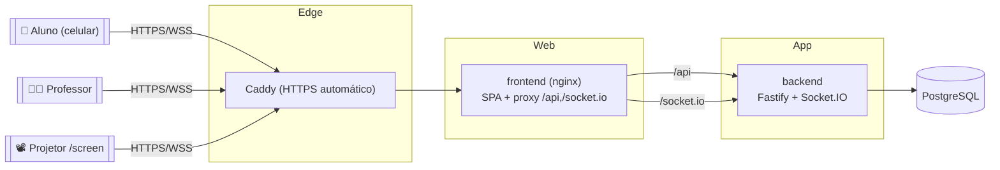

# Koinonia Class

Aplicativo web colaborativo para aulas de **Escola Bíblica Dominical (EBD)**.
O professor projeta uma tela na sala; os alunos participam pelo celular entrando
em uma **sala com código de 6 caracteres**, sem cadastro. O professor dispara
"momentos" (atividades) em tempo real e os resultados aparecem no projetor
instantaneamente.

Fundamentação pedagógica: Peer Instruction (Mazur), Think-Pair-Share (Lyman),
Just-in-Time Teaching, gamificação por Teoria da Autodeterminação, retrieval
practice e aprendizagem dialógica (Freire).

## Arquitetura (monorepo — npm workspaces)

```
/
├── shared     → tipos TypeScript + schemas Zod (eventos de socket, DTOs)
├── backend    → Node 20 + TypeScript + Fastify + Socket.IO + Prisma + PostgreSQL (SQLite em dev)
├── frontend   → React 18 + Vite + TypeScript + Tailwind + Zustand + socket.io-client + Recharts
├── docker-compose.yml
└── .env.example
```

## Instalação (5 comandos)

```bash
# 1. Instalar dependências de todos os workspaces
npm install

# 2. Configurar variáveis de ambiente
cp .env.example backend/.env    # ajuste JWT_SECRET; DATABASE_URL já usa SQLite em dev

# 3. Compilar os tipos compartilhados
npm run build -w shared

# 4. Criar o banco de dados e popular com dados de exemplo
npm run prisma:migrate -w backend && npm run prisma:seed -w backend

# 5. Rodar backend + frontend em modo desenvolvimento
npm run dev
```

O backend sobe em `http://localhost:3333` e o frontend em `http://localhost:5173`.

### Arquitetura (produção)



O `/shared` (tipos + schemas Zod) é consumido por back e front, garantindo o
mesmo contrato de eventos de socket e DTOs nas duas pontas.

### Professor demo (após o seed)

- E-mail: `professor@koinonia.dev`
- Senha: `demo1234`

## Scripts úteis (na raiz)

| Comando | Descrição |
|---|---|
| `npm run build` | Compila `shared`, `backend` e `frontend` |
| `npm run dev` | Sobe backend e frontend em paralelo |
| `npm run test` | Roda os testes dos três pacotes |
| `npm run lint` | Lint nos três pacotes |
| `npm run format` | Formata com Prettier |

## API REST — exemplos com `curl`

Com o backend rodando (`npm run dev -w backend`) e o banco populado pelo seed,
o fluxo completo funciona assim (professor demo):

```bash
BASE=http://localhost:3333

# 1. Login (retorna JWT em cookie httpOnly e no corpo)
TOKEN=$(curl -s -X POST $BASE/auth/login \
  -H 'Content-Type: application/json' \
  -d '{"email":"professor@koinonia.dev","password":"demo1234"}' \
  | node -pe 'JSON.parse(require("fs").readFileSync(0)).token')

# 2. Dados do professor autenticado
curl -s $BASE/auth/me -H "Authorization: Bearer $TOKEN"

# 3. Listar lições
curl -s $BASE/lessons -H "Authorization: Bearer $TOKEN"

# 4. Criar uma sala para a primeira lição
LID=$(curl -s $BASE/lessons -H "Authorization: Bearer $TOKEN" \
  | node -pe 'JSON.parse(require("fs").readFileSync(0)).lessons[0].id')
ROOM=$(curl -s -X POST $BASE/rooms -H "Authorization: Bearer $TOKEN" \
  -H 'Content-Type: application/json' -d "{\"lessonId\":\"$LID\"}")
echo "$ROOM"          # { "room": { "code": "XXXXXX", ... } }

# 5. Info pública da sala (sem auth — usada pela tela de entrada do aluno)
CODE=$(echo "$ROOM" | node -pe 'JSON.parse(require("fs").readFileSync(0)).room.code')
curl -s $BASE/rooms/$CODE/public

# 6. Encerrar a sala e gerar relatório
curl -s -X POST $BASE/rooms/$CODE/end -H "Authorization: Bearer $TOKEN"
RID=$(echo "$ROOM" | node -pe 'JSON.parse(require("fs").readFileSync(0)).room.id')
curl -s $BASE/rooms/$RID/report -H "Authorization: Bearer $TOKEN"
curl -s $BASE/rooms/$RID/report.csv -H "Authorization: Bearer $TOKEN"
```

Rotas principais:

| Método | Rota | Auth | Descrição |
|---|---|---|---|
| POST | `/auth/register` `/auth/login` | — | Cadastro/login do professor (JWT) |
| GET | `/auth/me` | ✅ | Professor autenticado |
| GET/POST | `/lessons` | ✅ | Listar / criar lições |
| GET/PUT/DELETE | `/lessons/:id` | ✅ | Detalhe / editar / excluir |
| POST | `/lessons/:id/duplicate` | ✅ | Duplicar roteiro |
| POST | `/lessons/:id/moments` | ✅ | Adicionar momento |
| PUT/DELETE | `/moments/:id` | ✅ | Editar / excluir momento |
| PATCH | `/lessons/:id/moments/reorder` | ✅ | Reordenar momentos |
| POST | `/rooms` | ✅ | Criar sala (código 6 chars) |
| GET | `/rooms/:code/public` | — | Info pública da sala |
| POST | `/rooms/:code/end` | ✅ | Encerrar sala |
| GET | `/rooms/:id/report(.csv)` | ✅ | Relatório consolidado |
| GET/POST | `/lessons/:id/preclass?token=…` | — | Pré-aula (link público) |
| GET | `/lessons/:id/preclass/summary` | ✅ | Resumo da pré-aula |
| POST | `/auth/whatsapp/request` `/register` `/verify` | — | Login/cadastro por número (OTP) |
| GET | `/auth/whatsapp/me` | ✅ | Usuário autenticado por número |
| GET/PATCH | `/profile` | ✅ | Perfil + preferência de leitura diária |
| GET/POST | `/daily-readings` | ✅ (prof.) | Listar / criar leitura diária |
| GET/PUT/DELETE | `/daily-readings/:id` | ✅ (prof.) | Detalhe / editar / excluir |
| POST | `/daily-readings/:id/publish` `/send` | ✅ (prof.) | Publicar / enviar por WhatsApp |
| GET | `/daily-readings/:id/art.png` `.svg` | — | Arte 1080×1080 (pública, por id) |

## Leitura Diária e WhatsApp (PARTE 10)

Membros podem entrar pelo **número de WhatsApp** (código OTP de 6 dígitos, só
hash no banco, expira em 5 min) e receber uma **leitura diária** com uma **arte
1080×1080** gerada no servidor na identidade visual do app. O envio (manual ou
agendado) respeita a preferência de cada membro (opt-out em `/profile`), evita
duplicidade e registra falhas. O número **nunca** é exibido público, no projetor
ou em relatórios. Detalhes de uso em `docs/GUIA-DO-PROFESSOR.md`.

O provedor de WhatsApp é abstraído: `WHATSAPP_PROVIDER=mock` (dev/test, registra
o OTP no log) ou `cloud` (WhatsApp Business/Graph API). Variáveis relevantes em
`.env.example`: `PUBLIC_BASE_URL`, `WHATSAPP_PROVIDER`, `WHATSAPP_API_URL`,
`WHATSAPP_ACCESS_TOKEN`, `WHATSAPP_PHONE_NUMBER_ID`, `WHATSAPP_BUSINESS_ACCOUNT_ID`,
`WHATSAPP_OTP_TEMPLATE_NAME`, `WHATSAPP_WEBHOOK_VERIFY_TOKEN` e
`TEACHER_WHATSAPP_ALLOWLIST` (números que se auto-registram como professor).

## Banco de dados

Em desenvolvimento usamos **SQLite** (`backend/prisma/dev.db`). Para produção,
altere o `provider` em `backend/prisma/schema.prisma` para `postgresql`, aponte
`DATABASE_URL` para o Postgres (veja `docker-compose.yml`) e rode as migrations.

```bash
docker compose up -d   # sobe um PostgreSQL 16 local
```

## Deploy

### Com Docker (recomendado) — `docker-compose.prod.yml`

Sobe PostgreSQL + backend + frontend (nginx) atrás do **Caddy** (HTTPS automático).

```bash
# 1. Gere um segredo forte para o JWT
export JWT_SECRET=$(openssl rand -hex 32)

# 2. (opcional) valide ambiente + conexão antes de subir
#    npm run deploy:check   # com DATABASE_URL/JWT_SECRET no ambiente

# 3. Suba tudo
docker compose -f docker-compose.prod.yml up --build
```

Acesse **https://localhost** (aceite o aviso do CA local do Caddy em dev; em um
domínio real o Caddy emite certificado Let's Encrypt automaticamente — basta
trocar `localhost` pelo domínio no `Caddyfile`).

O backend troca o provider do Prisma para **PostgreSQL** no build e aplica o
schema com `prisma db push` ao iniciar. Variáveis aceitas pelo compose:
`POSTGRES_USER`, `POSTGRES_PASSWORD`, `POSTGRES_DB`, `JWT_SECRET` (obrigatória),
`CORS_ORIGIN` (padrão `https://localhost`).

### Criar o primeiro professor

O cadastro é aberto (`/teacher/login` → registrar), mas você pode provisionar via CLI:

```bash
docker compose -f docker-compose.prod.yml exec backend \
  npm run create-teacher -w backend -- "Seu Nome" voce@exemplo.com senhaForte
```

### Backup e restauração do banco

```bash
# Backup
docker compose -f docker-compose.prod.yml exec postgres \
  pg_dump -U koinonia koinonia > backup.sql

# Restauração
cat backup.sql | docker compose -f docker-compose.prod.yml exec -T postgres \
  psql -U koinonia -d koinonia
```

### Sem Docker (alternativa gerenciada)

- **Frontend** (Vercel/Netlify): build `npm run build -w frontend`, publique
  `frontend/dist`. Configure `VITE_API_URL` e `VITE_WS_URL` apontando para o
  backend público (ou use um proxy/reescrita para caminhos same-origin).
- **Backend** (Railway/Render — com WebSocket habilitado): comando de start
  `node dist/server.js` após `npm run build -w backend`. Defina `DATABASE_URL`,
  `JWT_SECRET`, `PORT`, `CORS_ORIGIN`. Rode `prisma db push` (ou `migrate deploy`)
  no deploy.
- **Banco** (Neon/Supabase Postgres): use a `DATABASE_URL` fornecida; o provider
  do Prisma deve ser `postgresql`.

`npm run deploy:check` valida as variáveis de ambiente e a conexão ao banco
antes de publicar.

## Progresso

Este projeto é construído em partes; veja `docs/PROGRESS.md` para o checklist e
`docs/DECISIONS.md` para as decisões técnicas.
